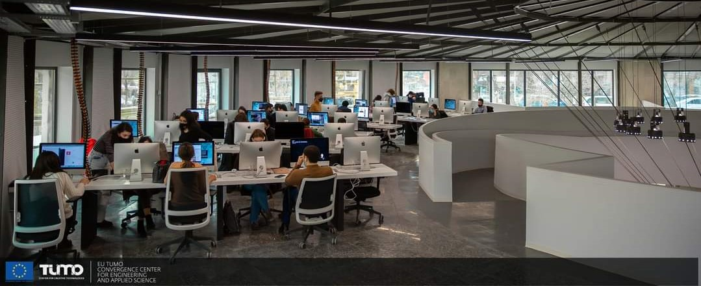
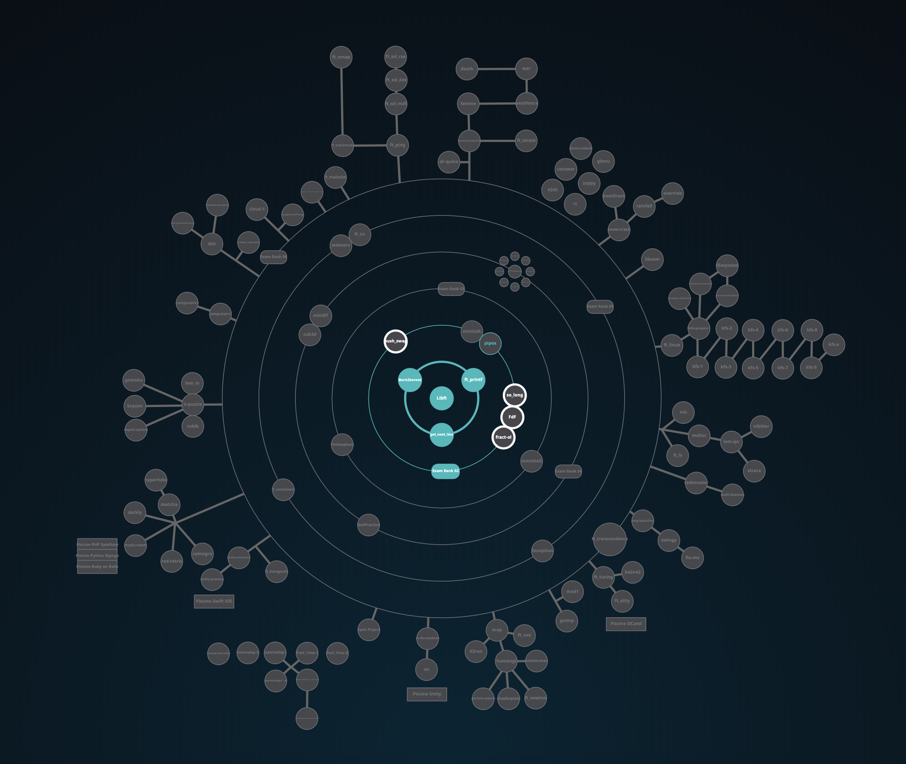

<h1 align="center">
	42cursus
</h1>

<h3 align="center">
	<a href="#%EF%B8%8F-about-42">About 42</a>
	 · 
	<a href="#%EF%B8%8F-skills-developed-at-42cursus">Skills developed at 42cursus</a>
	 · 
	<a href="#-42s-galaxy-curriculum">42's galaxy (curriculum)</a>
	 
	<a href="#-my-42-stats-card">My 42 Stats Card</a>
	 · 
	<a href="#-project-list">Project List</a>
</h3>

## 🗣️ About 42

	42 is a global education initiative that offers a new way of learning technology:
	no teachers, no classrooms, students learning from their fellow students (peer to peer
	learning), with a methodology that develops both computing and life skills. The 42 cursus is
	free for whoever is approved in its selection process* - the so-called "Piscine" - becoming
	thus "cadets" (42's students).

\* For further information about 42's **selection process** (the "Piscine"), please visit the [C Piscine repo](https://github.com/dpetrosy/42_piscine).

## 🛠️ Skills developed at 42cursus

### Hard-skills

	* C/C++ language, Makefile
	* Shell scripting
	* Git
	* Networks
	* Docker
	* SQL
	* Web (HTML, CSS, Wordpress)
	* Computer graphics
	* Assembly language

-- among others (find below the complete [curriculum](#-42s-galaxy-curriculum)).

### Soft-skills

	# Self-learning and proactivity
		At 42, self-learning is at the core of its peer to peer learning methodology. There
		are no teachers whatsoever; the learning process is based on googling, enquiring
		your classmates, and empirical knowledge, each student learning at their own pace.

	# Teamwork
		Some projects must or should be developed in groups, which promotes collaborative
		work among cadets. The major challenge here is to equalize the different knowledge
		levels while finding a common work methodology that allows all team members to
		contribute to the project.

	# Time management and resiliency
		The school is open 24/7. Thus, the cadets are free to work whenever they want, which
		demands excellent time management skills and resiliency for not "drowning" amid the
		massive load of work demanded by the program.

## 🌌 42's galaxy (curriculum)

**42cursus** comprises two groups of projects: the first one being known as _"inner circle"_ and the second one, _"outer treks"_ - due to the **Holy Graph** layout (see image below).

The **inner circle** is the basic curriculum, with all projects being mandatory to attain level 7 - which is the minimum level required for activities such as internships and interchange.

The **outer treks** is a collection of diverse project trails in subjects ranging from operational systems to web development which allows cadets to specialize on whatever subject they prefer.

## 👤 My 42 Stats Card

**begin date : 09/March/2022 👨🏻‍💻**

## 📜 Project List

### Common Circle

| CIRCLE | PROJECT                                                                         | LANGUAGE    | TOPICS                                                                                                                            | XP        | STATUS                                                                                                                                                        | ATTAINED LEVEL     |
| ------ | ------------------------------------------------------------------------------- | ----------- | --------------------------------------------------------------------------------------------------------------------------------- | --------- | ------------------------------------------------------------------------------------------------------------------------------------------------------------- | ------------------ |
| 00     | [Libft](./00_libft)                                                             | C           | `Library` `Makefile`   `Linked list`                                                                                         | 462       |              |  1 - 05%            |
| 01     | [ft_printf](./01_ft_printf)                                                     | C           | `variadic arguments`   `character parsing`   `unicode encoding`   `IEEE 754` `BigInt`   `Library` `Makefile`  | 882       |          |  1 - 44%           |
| 01     | [get_next_line](./01_get_next_line)                                             | C           | `file descriptor`   `static variable`   `buffer size`   `getline function`                                         | 882       |      |  1 - 94%           |
| 02     | [Born2beroot](./02_born2beroot)                                                 | Shell       | `Virtual machine`   `Linux` `SSH`   `Network & System administration`   `Firewall` `Shell scripte`                 | 577       |        |  2 - 14%           |
| 02     | Exam Rank 02                                                                    | C           | `C piscine Final Exam`   `Functions from Libft`                                                                              | 0         |       | no increse         |
| 03     | [push_swap](./push_swap)                                                        | C           | `algorithm` `stack` `sort`                                                                                                        | 1855      |          | no increse         |
